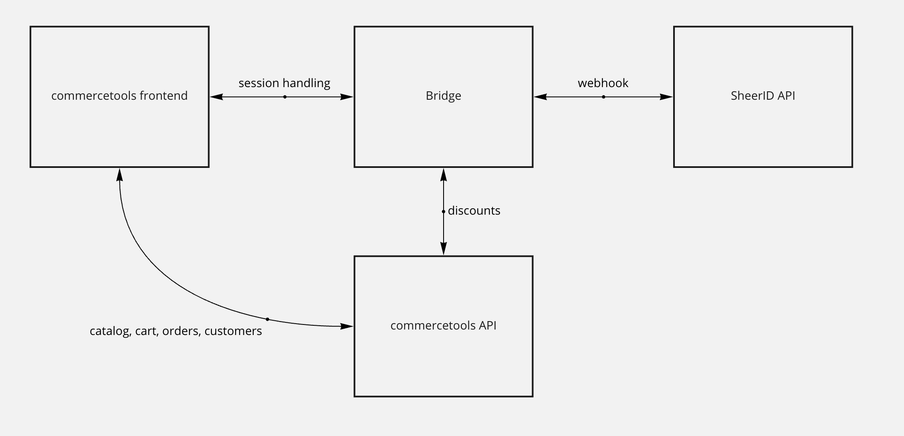

# SheerID - commercetools Bridge Demo

This is a lightweight integration demo showcasing the ease of integrating SheerID with any commercetools website. The demo is not meant to give feature complete solution integrating SheerID verification into an existing commercetools website, but to give ideas how to approach the integration task.

The demo code is using Sunrise SPA, a not feature complete single page application demo, where there is no session management implemented, to implement an end-to-end solution the cart and login handling would need substantial extra work with little value for the demo.

## Architecture


## Commercetools Frontend
The frontend is built from [SUNRISE SPA](https://docs.commercetools.com/sdk/sunrise), a simple commercetools demo framework ([GitHub link](https://github.com/commercetools/sunrise-spa)).

There were minimal changes to the demo frontend code, mainly to showcase the ease of integration.
- footer link (button, see below) linking to the SheerID verification from
- verified dropdown in the header, showing verified status, name and organisation
- minicart panel showing the same
- javascript code saving the verification data into localStorage

The footer link is creating a random key, session identifier would be used on other frontends. This key is used in the verification form URL as metadata, identifying the frontend session. A simple background process starts at the same time, polling the bridge with the same key regularly, waiting for the SheerID webhook returning to the bridge application with verification success.


The modified frontend code is under https://github.com/gpmd/commercetools-sheerid-demo

## Bridge application

The bridge is a simple node.js based server, accepting requests from the frontend and webhooks from SheerID verification API.

Bridge code is under https://github.com/gpmd/commercetools-sheerid

### Endpoints
Endpoints used in current demo:
- `/api/success-webhook` endpoint receiving SheerID verification webhook
- `/api/update` register current cart into Redis with session key
- `/api/verify` frontend endpoint checking verification status

Unused endpoints, containing untested or not necessary code and hints how to extend the functionality of both systems:
- `/` just a holding page
- `/api/create-webhook` example, how to use SheerID API to automatically create the webhook
- `/api/cart-discounts` example, how to list commercetools cart discounts
- `/api/getcarts` example, getting a list of open carts from commercetools API
- `/api/webhook` example, creating cart discount using commercetools API

## SheerID API

SheerID's my.sheerid.com dashboard, set up to send verification id to the webhook endpoint of the bridge application.

## commercetools API

The commercetools backend is serving the SUNRISE SPA frontend and through admin API calls the bridge (see not necessary extra endpoints above).

## Links

[Demo Sunrise website](https://demo.commercetools.com/)

[Sunrise frontend](https://docs.commercetools.com/sdk/sunrise)

[Sunrise CommerceTools demo data](https://docs.commercetools.com/sdk/sunrise-data)

### Start guide

You need to install the dependencies with `yarn install --frozen-lockfile`, then you can start the project with `yarn start`.

If you want to use the default merchant center project there is no need to add a `.env` file, if you want to connect to your own merchant center project you need to [set this up](https://github.com/commercetools/sunrise-spa/tree/development/Docs#Environment-variables)

```bash
yarn start
```

## Build instuctions
Run

```bash
yarn build
```
and copy the generated `dist` folder to the server, serve it with [a simple web server](https://github.com/gpmd/webserver).

## SheerID Bridge

This repository is to be used together with `https://github.com/gpmd/commercetools-sheerid` bridge.
